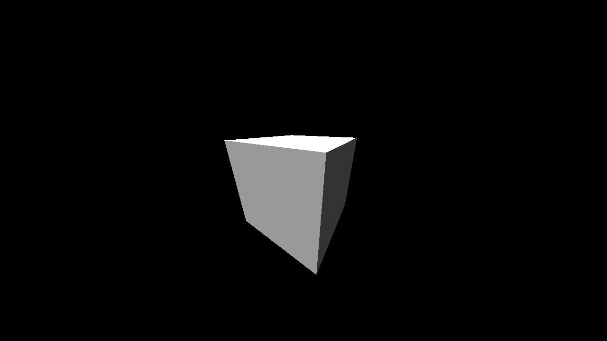

# GPWE - General Purpose World Engine

<p><br /></p>

GPWE is an engine designed primarily for creating games and 3D environments, but can be used for worlds of any kind.

<p><br /></p>

## Features

<p><br /></p>

| Feature | Status |
|:--------|:------:|
| HDR deferred renderer | ✅ |
| Real-time ray tracing | ❌ |
| Bullet physics integration | ❌ |

<p><br /></p>

## Dependencies

<p><br /></p>

| Dependency | Included |
|:-----------|:--------:|
| SDL2       | ❌ |
| Freetype   | ❌ |
| FreeImage  | ❌ |
| Assimp     | ✅ |
| glm        | ✅ |
| glbinding  | ✅ |

<p><br /></p>

### Installing system dependencies

<p><br /></p>

#### Ubuntu

```bash
sudo apt install libsdl2-dev libfreetype-dev libfreeimage-dev
```
<p><br /></p>

## Building

```bash
mkdir build
cd build
cmake .. -DCMAKE_BUILD_TYPE=Debug
cmake --build . -- -j$(nproc)
```

<p><br /></p>

## Screenshots

<p><br /></p>

There isn't much to show off yet, so here's a cube with fake lighting:

<p align="center">

</p>
